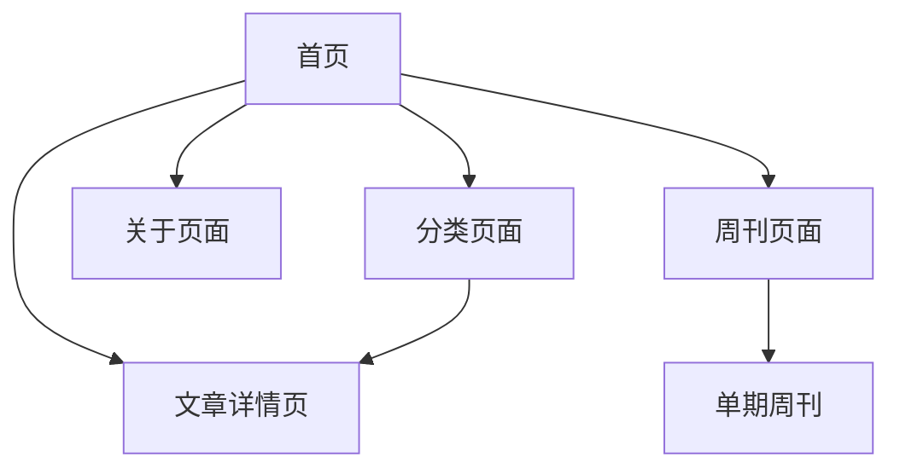

## 1. 产品概述
良之世界个人博客系统是一个专注于内容创作的轻量级个人博客平台。通过简洁的设计风格和Markdown写作支持，让用户能够专注于哲学、心理、逻辑、电商等领域的内容分享，同时提供周刊栏目展示个人思考与见解。

目标用户为内容创作者和个人品牌建设者，核心价值在于提供低成本、易维护、高性能的内容发布平台，支持liang.world域名的个人品牌展示。

## 2. 核心功能

### 2.1 用户角色
| 角色 | 注册方式 | 核心权限 |
|------|----------|----------|
| 访客 | 无需注册 | 浏览文章、查看周刊、访问关于页面 |
| 管理员 | 本地配置 | 发布/编辑文章、管理周刊、修改网站设置 |

### 2.2 功能模块
良之世界博客包含以下核心页面：
1. **首页**：文章列表、周刊入口、导航菜单
2. **博客详情页**：文章内容、相关推荐、分享功能
3. **周刊页面**：周刊列表、单期周刊内容
4. **关于页面**：个人介绍、联系方式、社交媒体链接
5. **分类页面**：按哲学、心理、逻辑、电商分类展示文章

### 2.3 页面详情
| 页面名称 | 模块名称 | 功能描述 |
|----------|----------|----------|
| 首页 | 文章列表 | 展示最新博客文章，包含标题、摘要、发布时间、分类标签 |
| 首页 | 周刊入口 | 显示最新周刊的封面和简介，点击查看详情 |
| 首页 | 导航菜单 | 包含博客、周刊、关于、分类的导航链接 |
| 博客详情页 | 文章内容 | 显示Markdown渲染后的完整文章内容 |
| 博客详情页 | 文章信息 | 展示文章标题、发布时间、分类、标签、阅读量 |
| 博客详情页 | 分享功能 | 提供文章链接复制、社交媒体分享选项 |
| 周刊页面 | 周刊列表 | 按时间倒序列出所有周刊，显示期数和发布时间 |
| 周刊页面 | 单期周刊 | 展示周刊标题、内容和发布日期 |
| 关于页面 | 个人介绍 | 展示博主的个人简介和专业背景 |
| 关于页面 | 联系方式 | 提供邮箱或其他联系方式 |
| 关于页面 | 社交链接 | 展示GitHub、Twitter等社交媒体链接 |
| 分类页面 | 分类筛选 | 按哲学、心理、逻辑、电商四个分类筛选文章 |
| 分类页面 | 分类列表 | 展示选中分类下的所有文章 |

## 3. 核心流程
用户访问流程：
1. 访客通过liang.world域名访问首页
2. 浏览最新文章列表或点击周刊入口
3. 点击感兴趣的文章标题进入详情页阅读
4. 通过导航菜单访问关于页面了解博主信息
5. 通过分类页面按主题浏览相关文章

管理员操作流程：
1. 使用Markdown编写新文章
2. 为文章添加分类标签（哲学/心理/逻辑/电商）
3. 发布文章到对应分类
4. 定期发布周刊内容
5. 更新关于页面信息

## 4. 用户界面设计

### 4.1 设计风格
- **主色调**：简洁的白色背景，搭配深灰色文字（#333333）
- **强调色**：淡雅的蓝色（#4A90E2）用于链接和按钮
- **按钮样式**：扁平化设计，圆角4px，hover状态轻微阴影
- **字体**：系统默认字体栈，优先使用-apple-system、BlinkMacSystemFont
- **字体大小**：正文16px，标题按层级递减（32px、24px、20px、18px）
- **布局风格**：卡片式布局，内容居中显示，最大宽度800px
- **图标风格**：使用简洁的线性图标，避免复杂装饰

### 4.2 页面设计概览
| 页面名称 | 模块名称 | UI元素 |
|----------|----------|--------|
| 首页 | 文章列表 | 卡片式布局，每张卡片包含标题（20px加粗）、摘要（16px灰色）、发布时间（14px浅灰）、分类标签（12px蓝色圆角） |
| 首页 | 周刊入口 | 顶部横幅设计，背景淡蓝色渐变，标题24px白色，简介16px白色半透明 |
| 首页 | 导航菜单 | 顶部固定导航栏，白色背景，菜单项16px深灰色，hover状态显示下划线 |
| 博客详情页 | 文章内容 | 文章标题32px加粗居中，正文16px行高1.8，代码块灰色背景，引用左侧蓝色边框 |
| 博客详情页 | 文章信息 | 标题下方显示发布时间、分类、标签，14px浅灰色，标签使用蓝色圆角样式 |
| 周刊页面 | 周刊列表 | 时间轴式设计，左侧显示期数，右侧显示标题和简介，分割线使用淡灰色 |
| 关于页面 | 个人介绍 | 头像圆形显示150px直径，个人简介18px行高1.6，联系信息使用图标+文字组合 |

### 4.3 响应式设计
- **桌面优先**：默认针对1920x1080分辨率优化
- **移动端适配**：
  - 平板（768px-1024px）：保持桌面布局，适当调整间距
  - 手机（<768px）：单栏布局，导航菜单变为汉堡菜单，字体大小减小10%
- **触控优化**：按钮和链接点击区域最小44px，避免过密的交互元素

### 4.4 Markdown渲染规范
- **标题**：支持H1-H6，H1居中显示，H2左侧有装饰线
- **段落**：默认16px，行高1.8，段落间距1em
- **列表**：有序列表使用数字，无序列表使用圆点，缩进2em
- **代码**：行内代码灰色背景，代码块深色主题，支持语法高亮
- **引用**：左侧蓝色边框，背景淡灰色，内边距1em
- **链接**：蓝色文字，hover状态显示下划线
- **图片**：最大宽度100%，自动居中，支持点击放大查看